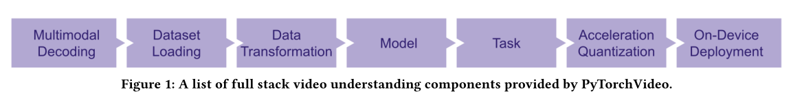

# 第八章 PyTorch生态简介
PyTorch之所以如此强大且风靡, 不仅在于其本身工具的易用性, 更在于开源社区产生的大量的丰富工具包以及程序, 这使得PyTorch在特定领域有非常多方便的应用.

接下来本章主要将围绕PyTorch生态在图像, 视频, 文本等领域中的开源工具的发展, 并且进行一些典型的工具包的详细介绍.

## 8.1 torchvision
```torchvision```包含了在计算机视觉领域中常使用的数据集, 模型以及图像处理的方式.

接下来我们将就以下几个库进行介绍
+ torchvision.datasets *                           
+ torchvision.models *
+ torchvision.tramsforms *
+ torchvision.io 
+ torchvision.ops
+ torchvision.utils

### 8.1.2 torchvision.datasets
此库包含了一些我们在计算机视觉中常见的数据集.

| Caltech       | CelebA           | CIFAR             | Cityscapes |
| ------------- | ---------------- | ----------------- | ---------- |
| **EMNIST**    | **FakeData**     | **Fashion-MNIST** | **Flickr** |
| **ImageNet**  | **Kinetics-400** | **KITTI**         | **KMNIST** |
| **PhotoTour** | **Places365**    | **QMNIST**        | **SBD**    |
| **SEMEION**   | **STL10**        | **SVHN**          | **UCF101** |
| **VOC**       | **WIDERFace**    |                   |            |

### 8.1.3 torchvision.transforms
transforms内置了许多数据的处理方法.
- 常见的数据预处理方法
    - 归一化
    - 大小缩放
- 数据增强方法
    - 缩小\放大
    - 水平或垂直翻转
    
```Python
from torchvision import transforms
data_transform = transforms.Compose([
    transforms.ToPILImage(),   # 这一步取决于后续的数据读取方式，如果使用内置数据集则不需要
    transforms.Resize(image_size),
    transforms.ToTensor()
])
```

### 8.1.4 torchvision.models
本库中内置了一些预训练好的模型让我们使用.

预训练的模型可以分为几类:
- 分类
- 语义分割
- 物体检测, 距离检测, 人体关键点检测等
- 视频分类

## 8.2 PyTorchVideo

近年来关于视频的深度学习模型在快速发展, 但是仍然存在很多问题:
- 计算资源耗费过大, 且没有像图片一样的良好生态, 拥有丰富的预处理模型和迁移学习的条件.
- 数据集处理比较麻烦

PyTorchVideo提供视频理解研究过程中需要的可重复使用, 模块化和高效的组件. 包括视频模型, 视频数据集和transforms方法等.



### 8.2.1 PyTorchVideo的主要功能
PyTorchVideo的主要功能如下
- 数据预处理和常见数据
- 模块化设计: 拥有data, transforms, layer, model, accelerator等模块, 方便用户进行调用.
- 支持多模态
- 移动端部署优化

### 8.2.2 安装
```shell
pip install pytorchvideo
```

注:
- 安装的虚拟环境的python版本 >= 3.7
- PyTorch >= 1.8.0, 安装的torchvision也需要匹配
- CUDA >= 10.2
- ioPath: [具体情况](https://github.com/facebookresearch/iopath)
- fvcore版本 >= 0.1.4: [具体情况](https://github.com/facebookresearch/fvcore)

## 8.3 torchtext
torchtext是PyTorch官方用户进行NLP相关研究的工具包. NLP近年来随着大规模预训练模型的应用, 在人机对话, 机器翻译领域取得了非常好的效果, 也使得NLP相关的深度学习模型获得了非常多的关注.

torchtext和torchvision在一些工具包的使用上有一些差异:
- dataset的定义方式不同
- 数据预处理工具不同
- 没有特别多样化的model zoo

### 8.3.1 torchtext的组成
- 数据处理工具 torchtext.data.functional, torchtext.data.utils
- 数据集 torchtext.data.datasets
- 词表工具 torchtext.vocab
- 评测指标 torchtext.metrics

### 8.3.2 安装
```Shell
pip install torchtext
```

### 8.3.3 数据集的构建
- 使用Field进行数据转化

Field是定义数据类型以及转换为张量的指令. 使用Field抽象一个样本的文字, 可以将不同形式的字段文本处理成相同格式的数据进行储存.

- 词汇表(vocab)

在NLP中, embedding是将字符串形式的文本转变为数字形式的向量的过程. 我们需要通过收集一个相关的大语料库, 在语料库中使用word2vec之类的方法构建词语与向量之间的映射关系, 然后将句子转化为向量表示.

torchtext中可以使用build_vocab函数进行构建
```python
torchtext.Field.build_vocab(train)
```

- DataLoader

- 自带数据集的使用

### 8.3.4 评判标准
NLP中的任务评测不全是使用准确率进行判断指标, 而是经常使用相似矩阵的形式来判断预测文本和标注文本的相似成都, 比如机器翻译任务中常用BLEU score来进行评价.

torchtext中可以使用torchtext.data.metrics.bleu_score.
